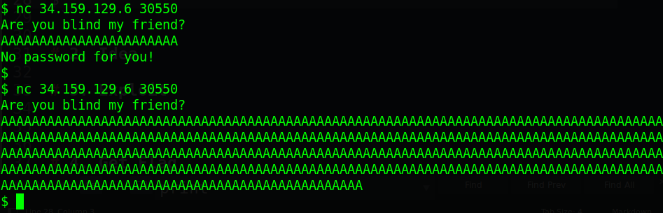
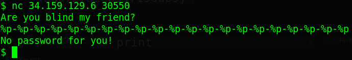
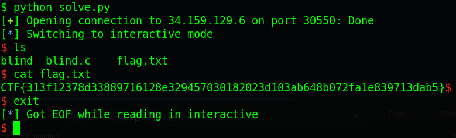

# dctf21.cyberedu.ro - blindsight

### Reference source:

- https://www.ctfiot.com/24867.html (Chinese)

- https://www.youtube.com/watch?v=vzqjCYzpmBk (English)

---

Origin challenge link: https://dctf21.cyberedu.ro/

But you can also download challenge in my repo: [blindsight.zip](blindsight.zip)

There will be 1 file in zip:

- libc-2.23.so

Download the zip and let's start!

# 1. Find bug

There is no ELF file, we just interact online with server. Anything we can do is to try every technique to see what can we get. Quite hard! 

Anyway, let's try first if there is buffer overflow or not:



We can see clearly that when we input a ton of `A`, the program didn't print out `No password for you!` --> **Buffer Overflow**

Next, we will try if there is format string bug or not:



Oh we are unfortunate! Moreover, our input wasn't executed after input so that's all we can get. 

Anyway, just **buffer overflow** is enough. Let's move on brainstorming part.

# 2. Brainstorming

As the name of challenge hinted **blind**sight, after googling `blind binary exploit`, we know that we have a technique called [Blind Return Oriented Programming (BROP)](https://en.wikipedia.org/wiki/Blind_return_oriented_programming) which we will need for this challenge. 

First thing we need to do is to find stop_gadget, which will 

# 3. Exploit

	<detail>
	<summary>Table of Content</summary>
	<p>
	```
	1. Finding stop_gadget
	2. Finding useful_gadget
	3. Finding main address
	4. Finding puts@plt
	5. Dumping stack
	6. Get shell
	```
	</p>
	</detail>


# 4. Get Flag



Flag is `CTF{313f12378d33889716128e329457030182023d103ab648b072fa1e839713dab5}`